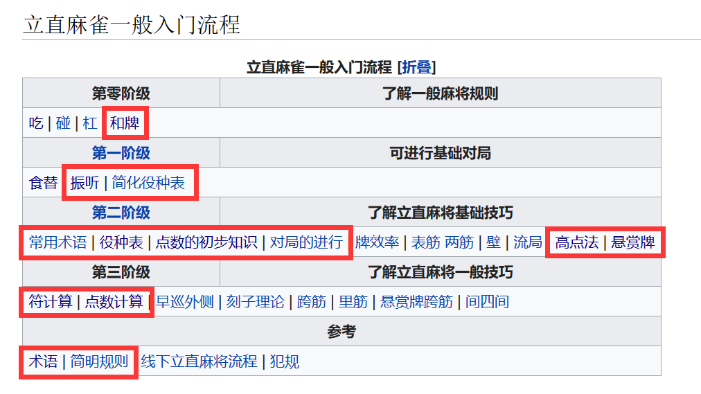

# 我要成为霓虹麻将高手！

> 出题人：咲夜黎

## Change Log

2024/1/21 23:45 更新内容：

1. 更新了 OJ 在 Linux 系统中执行的编译脚本 compile.sh，你可以在本地 Linux 系统中用该指令编译测试。
2. 在 main.c 与 majsa.c 中增加了一个样例，目前共有两个样例。
3. 纠正样例 0 的输出。
4. 完成了测试框架，目前测试用例即为两个样例。
5. 注意，役种 Yaku 的排序是按照役种所对应的**十六进制数排序**，并非按照其展示顺序排序。
6. 注意，若 OJ 提示评测失败，则为**未使用 Git** 管理你的代码仓库；若为编译错误，很可能是你改动了目录结构或者在 main.h 中新增了依赖（不要依赖于那些会被 OJ 替换掉的文件！），也可能是你没有 git commit，OJ 只认 commit 后的代码，未 commit 的代码不会被评测到。
7. 注意，不要在文件夹中新建**会产生冲突的** .c 代码文件（如不要新建 main1.c`），因为现在的编译模式是联合所有 .c 文件编译，冲突的代码文件会导致编译错误。
8. 调整了分数占比，降低了向听数的占比。

2024/1/21 16:00 更新内容：

1. 更新了 Makefile 与 CMakeLists，Makefile 需要在 Linux 系统中使用，CMakeLists 可以在 Windows 中的 CLion 使用。
2. 将 `KazeType` 中的南风 `NAN` 改为 `NANN`，避免与 `math.h` 冲突。
3. 文档勘误。
4. 注意，由于 git 冲突问题可能你还不会解决，建议再次 clone 新框架，并将你已经完成的代码复制进新框架中。

## 题目描述

霓虹麻将（学名：Japanese Mahjong / Riichi Mahjong / 麻雀 / マージャン）是一种千年前由华夏大地流传至倭地，在当地发展至今的一种麻将玩法。

> 为什么咲夜黎会选择霓虹麻将而不是华夏大地那么多种麻将呢？
>
> 因为国标、川麻、沪麻、广麻等各有千秋，且各位来自全国各地的同学或许从家长那里或多或少学会了一些本地麻将的规则，可能会被已有认知干扰。
>
> 而霓虹麻将有一套完整的成体系的规则，且更加复杂，大家都不怎么熟，更加适合拿来出项目题。

关于霓虹麻将本身的讲解，请看题目注解，可以参考 [最完整的日本麻將中文維基百科 (lingshangkaihua.com)](https://wiki.lingshangkaihua.com/mediawiki/index.php/首页) ，在此先描述本项目的需求，这是一道客观题。



上述流程图为一种供参考的实现方式，向流程中输入霓虹麻将的初始台面状态（并非完全状态，仅由对后续流程有用的状态组成）：

1. 检查台面状态（自家牌 + 当前控牌共 14 张）是否满足和牌形（国士无双 / 七对子 / 四面子一对子），并检查是否振听（仅考虑舍牌振听，立直振听与同巡振听不做考虑），如果满足和牌形且无振听，则进入④，否则进入②；
2. 检查台面状态（自家牌 13 张）是否听牌，虚听不算听牌，若已听牌，进入⑦，否则进入③；
3. 计算向听数（自家牌 13 张），即要满足听牌牌型最少需要替换掉几张牌，向听数最大为 6 （因为七对子听牌），计算结束后进入终止状态，返回不听牌状态；
4. 检查满足的役种（自家牌 + 当前控牌共 14 张），记录下所满足的役种，注意役种有替代性（如满足两杯口时则没有一杯口与七对子役种），注意若牌型有多种组合方式，应选择番数最高的役种集合，且若包含役满/两倍役种，则不返回其他非役满役种，进入⑤；
5. 计算最高符数（自家牌 + 当前控牌共 14 张），注意符数计算可能有多种结果，应取最高值后再按照符数规则向上向整十数取整，国士无双时不需要计算符数，进入⑥；
6. 根据满足的役种与宝牌情况（宝牌、里宝牌、赤宝牌）计算番数，根据番数、符数与场供情况（~~立直棒数、~~本场棒数）计算三家要付给自家的点数，计算结束后进入终止状态，返回和牌结算状态；
7. 计算面听数（自家牌 13 张），即当前听牌状态下，可以通过哪几张牌来和牌，只需得到面听数即可，不需要得到具体哪几张牌，计算结束后进入终止状态，返回听牌不和状态。

> 为什么说上述流程图仅为一种参考呢？
>
> 因为步骤①②③是可以相辅相成的，例如通过计算向听数可以直接得到是否听牌与是否为和牌形，所以这部分是可以自由发挥的。

通过这张流程图可以看出本题所需要得到的究竟是个什么样的程序，即为初始台面状态与结果状态的一个函数（定义在 `main.h` 中的 `Result *majsa(Status*)` 函数）。

初始台面状态为如下定义：

```c
struct status {
  KazeType bakaze;       // 场风
  KazeType jikaze;       // 自风
  int honbaCount;        // 本场棒数，不考虑遗留立直棒数
  char dora[12];         // 宝牌指示牌
  char uradora[12];      // 里宝牌指示牌
  char handTile[30];     // 自家手牌
  Group groupTile[30];   // 自家副露区（包括暗杠）
  char discardTile[60];  // 自家舍牌区（包含被别家副露掉的牌）
  Player currentPlayer;  // 当前控牌玩家
  char currentTile[2];   // 当前控牌
  int remainTileCount;   // 牌山剩余牌数
  bool isRiichi;         // 是否已立直
  bool isDoubleRiichi;   // 是否为两立直
  bool isIppatsu;        // 是否为一发
  bool isRinshan;        // 是否为岭上牌
};
typedef struct status Status;
```

结果状态为如下定义：

```c
struct result {
  ResultType type;  // 结果类型
  Yaku yaku[20];    // 役种，排除古役、抢杠与流局满贯，请按升序排列
  int han;          // 番数，约定役满役种得到的番数为负数，X倍役满即为 -X，以此与累计役满区分
  int fu;           // 符数，国士无双时符数无意义
  int point[3];     // 点数，三家各自要给自家的点数，不考虑包牌，下标为 0=上家，1=对家，2=下家
  int machi;        // 面听数
  int shanten;      // 向听数
};
typedef struct result Result;
```

关于这两个数据结构的具体解释，可参考下文测试样例。

OJ 会在评测时给定不同的初始台面状态，运行你所编写的代码，判断你所得到的结果状态与标准结果状态是否相同来进行评分。

评分时针对结果状态为分段评分，即对结果状态中每一个变量独立判断，以此分段构成本项目的分数。

至于程序具体如何去实现，可以参考上述流程图，也可以自行设计，总体目标就是完成定义在 `majsa.h` 中的 `Result *majsa(Status*)` 函数。

框架代码中根据上述流程图提供了部分函数接口，可以以此为基础实现，也可以自行重构，同时也可以自行创建你想要的数据结构，**但与 `Status`、`Result`、`majsa()` 相关的任何定义（包括如 `KazeType`、`Yaku` 等的定义）均不建议改动，否则后果自负。**

## 项目框架

基于上述流程图，给出了本题的项目框架：

```txt
.
├── Makefile
├── CMakeLists.txt
├── README.md
├── assets
└── src
    ├── AgariChecker.c
    ├── AgariChecker.h
    ├── Calculator.c
    ├── Calculator.h
    ├── YakuChecker.c
    ├── YakuChecker.h
    ├── main.c
    ├── main.h
    ├── majsa.c
    └── majsa.h
```

## 你能做的事情

- 新增 `.c`、`.h` 文件。
- 修改或删除 `AgariChecker.c/h `、`Calculator.c/h `、`YakuChecker.c/h `、`main.c`（可以自己造用例，因为 OJ 会替换掉它）。
- 修改 `majsa.c/h` 中除 `Result *majsa(Status*)` 定义外的内容，当然，你需要去实现这个函数，如果更改了函数定义，测试就没法定位了，后果自负。
- 修改 `Makefile` 或 `CMakeLists.txt` 中除 git 目标依赖的部分，我们在 Makefile 中确保了你的每一次编译运行都能够自动进行 git commit。这些自动的 commit 可以帮助你回滚到自己想要的任意版本，并且在未来查重工作中产生疑问时，良好的 commit 记录将成为重要的证明。

> 与 `Status`、`Result`、`majsa()` 相关的任何定义（包括如 `KazeType`、`Yaku` 等的定义）均不建议改动，否则后果自负。

## 测试样例

在 OJ 评测你所提交的代码时，会替换掉 `main.c/h` 与 `Makefile` 三个文件。`Makefile`、`main.h` 与原框架一致，`main.c` 的一种检查方式如下：

```c
int main(){
  Status status = {
      .bakaze = TON,
      .jikaze = TON,
      .honbaCount = 0,
      .dora = "1m",
      .uradora = "3s",
      .handTile = "1m9m1p9p1s9s1z2z3z4z5z6z7z",
      .groupTile = {},
      .discardTile = "2m3m4m5m3p4p5p6p2s3s4s5s",
      .currentPlayer = JICHA,
      .currentTile = "1z",
      .remainTileCount = 18,
      .isRiichi = false,
      .isDoubleRiichi = false,
      .isIppatsu = false,
      .isRinshan = false,
  };
  Result *result = majsa(&status);
  assert(result->type == TSUMO);
  Yaku stdYaku[20] = {0};
  stdYaku[0] = Kokushijuusanmenmachi;
  assert(sizeof(result->yaku) == sizeof(stdYaku));
  for (int i = 0; i < 20; i++){
    assert(result->yaku[i] == stdYaku[i]);
  }
  assert(result->han == -2);
  // assert(result->fu == 30);  // 国士无双，不考虑符数
  assert(result->point[KAMICHA] == 32000);
  assert(result->point[TOIMEN] == 32000);
  assert(result->point[SHIMOCHA] == 32000);
  // assert(result->machi == 13);  // 已和牌，不考虑面听数
  // assert(result->shanten == 0);  // 已和牌，不考虑向听数
  return 0;
}
```

### 测试样例解释

- 场风 `bakaze`与自风 `jikaze` 均为枚举类型，详见框架代码，注意到自风 `jikaze` 为 `TON` 时自家为庄家，其余自风时自家为客家，会影响点数计算。由于南风 `NAN` 与 `math.h` 中的 `NAN` 冲突，故将南风改为 `NANN`。
- 本场棒数 `honbaCount` 为非负整数，若为 `1`，即为一本场，影响点数计算。
- 宝牌指示牌 `dora`、里宝牌指示牌 `uradora`、手牌 `handTile`、副露区 `groupTile` 中的字符串、舍牌区的牌 `discardTile` 与当前控牌 `currentTile` 的字符串格式均为两个字符表示一张牌，对应关系如下：

  - `1m` - `9m`：🀇 - 🀏；
  - `1p` - `9p`：🀙 - 🀡；
  - `1s` - `9s`：🀐 - 🀘；
  - `1z` - `7z`：🀀🀁🀂🀃🀆🀅🀄；
  - `0m` / `0p` / `0s`：赤宝牌 🀋 / 🀝 / 🀔；
  - 字符串中牌序可能为无序。
- 当前控牌玩家 `currentPlayer` 为枚举类型，当其为自家 `JICHA` 时，意味着自家摸牌后尚未打出的状态，当前控牌为自家摸进的牌；当其为别家 `KAMICHA`、`TOIMEN`、`SHIMOCHA` 时，意味着别家打出了牌时的状态，当前控牌为别家打出的牌。即当其为自家时，结果状态中的结果类型可能可以为自摸 `TSUMO`；当其为别家时，结束状态中的结束类型可能可以为荣和 `RON`。
- 副露区 `groupTile` 由副露类型与牌字符串组成，副露类型为枚举类型，有顺子 `Shuntsu`、刻子 `Koutsu`、杠子 `Kantsu` 与暗杠 `Ankan`（为简化数据结构，姑且将暗杠算入副露区中，但别忘了暗杠并不破坏门清）。
- 牌山剩余牌数 `remainTileCount` 、是否已立直 `isRiichi`、是否为两立直 `isDoubleRiichi`、是否为一发 `isIppatsu` 与是否为岭上牌 `isRinshan` 是否用于判断是否有役种海底摸月 `Haiteiraoyue` 、河底捞鱼 `Houteiraoyui`、立直 `Riichi`、两立直 `doubleRiichi`、一发 `Ippatsu`、岭上开花 `Rinshankaihou`。
- 结果状态中的结果类型为枚举类型，有荣和 `RON`、自摸 `TSUMO`、听牌 `TENPAI`、振听 `FURITEN` 与不听 `NOTEN`。
- 样例中的手牌为 🀇🀏🀙🀡🀐🀘🀀🀁🀂🀃🀆🀅🀄，是国士无双十三面听的牌型，加上自家摸进的当前控牌 🀀 后，达成了国士无双和牌形，役种为国士无双十三面 `Kokushijuusanmenmachi`，番数为 `-2`（约定役满役种得到的番数为负数，如四暗刻役满即为 `-1`，国士无双十三面两倍役满即为 `-2`，以此与累计役满区分），不考虑符数，上家对家下家都要付给自家 `32000` 点数，结果类型为自摸 `TSUMO`。
- 样例中的检验答案是否正确的部分使用了 `assert()`，这并非最终 OJ 的实现方式（因为 OJ 还需要分段给分），但是在这里用会更直观，本地测试的时候也可以这样写。

## 评分标准

评分标准均基于结果状态中的各个数据。这部分仅为示例，并非最终标准（因为测试还没出，且健雄书院与软件学院要求不一样）。

- 正确完成结果类型的判断 $10\%$
- 正确得到正确顺序的役种列表 $30\%$
- 正确得到番数 $10\%$
- 正确得到符数 $10\%$
- 正确得到点数列表 $10\%$
- 正确得到面听数 $20\%$
- 正确得到向听数 $10\%$
- 附加任务：如果你做不到所有情况的完全正确，可以在完成部分正确性的同时，实现更多霓虹麻将部分（比如将其进一步完善为一个可交互的游戏），需在本题提交部分正确的代码，在自选题目提交更多霓虹麻将部分并完成实验报告，即通过主观题来弥补客观题拿不满的分数。附加任务封顶 $50\%$
- 除附加任务外，客观题部分不需要撰写实验报告，整个项目封顶 $100\%$

## 题目注解

如果你完全不知道霓虹麻将的规则，可以去 [雀魂](https://game.maj-soul.com/1/) 注册一个账号玩两把，玩玩就会了，或者查看 [最完整的日本麻將中文維基百科 (lingshangkaihua.com)](https://wiki.lingshangkaihua.com/mediawiki/index.php/首页) 中以下部分：



你可能会好奇，本题框架代码中的变量命名为什么会这么奇怪，像是我国南方地区方言的拼音，又不完全是。

其实霓虹麻将的读音就是从我国南方地区的方言演变过去的，而小日子们接触英文很早，于是它们将那套霓虹麻将的读音音译成了英文字母的拼写方法。至于这些拼写方法是从哪里得到的，可以查看 [Japanese Mahjong Wiki (riichi.wiki)](https://riichi.wiki/Main_Page)。


